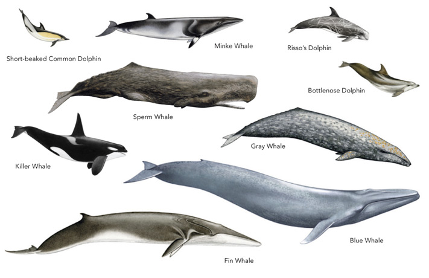

```{r setup, include=FALSE, warning=FALSE}
knitr::opts_chunk$set(echo = TRUE)
library(raster)
library(tidyverse)
library(janitor)
library(sf)
library(fasterize)
library(here)
library(rnaturalearth)
library(ggspatial) 
library(rgeos)
```

There are over 35 different species of cetaceans found in the Southern California Bight, an area that includes coastal Southern California and the Channel Islands. Some of the species found here include humpback whales, blue whales, common dolphin, Pacific white-sided dolphin and many more. The following explores cetaceans species richness in the area using a species distribution maps created by AquaMaps. These species distribution maps were modeled using large sets of occurrence data from GBIF and OBIS combined with estimates of environmental preferences including depth, water temperature, salinity, and primary productivity. 



*Data Citation: Kaschner,K., Rius-Barile, J., Kesner-Reyes, K., Garilao, C., Kullander, S., Rees, T., & Froese, R. (2016). AquaMaps: Predicted range maps for aquatic species. www.aquamaps.org*

---

## Analysis 

Step 1: Create Raster Stack of 35 cetacean species

```{r}
## first create a path to the folder and read in all teh files
aquamaps_path <- "ca_cetaceans"
all_files <- list.files(aquamaps_path, full.names = TRUE)

## read in all the tif files in using lapply()
species_raster <- lapply(all_files, raster)

## now that we have all thes species raster, lets create a stack and plot them
species_stack <- stack(species_raster)

## let's see what the data looks like
species_stack_df <- species_stack %>% 
  as.data.frame()

## Let's double check our crs to make sure it matched the project area
# projection(species_stack)

plot(species_stack)
```

Step 2: Reclassify species distribution as presence/absence data

```{r}
## reclassify the species distribution to presence/absence data using a threshold of 0.6
species_richness <- reclassify(species_stack, c(-Inf,0.59, 0, 0.59, Inf, 1))

species_richness_df <- species_richness %>% 
  as.data.frame()

plot(species_richness)
```


Step 3: Combine to create a species richness layer

```{r}
## now lets sum all the cells to get a count of how many species are in each cell
species_richness_sum <- calc(species_richness, fun = sum, na.rm = TRUE) 

## plot to see what that looks like
plot(species_richness_sum)

```

Step 4: Create a map of the results

```{r}
## load in a basemap to use from rnatrualearth package
base_map <- ne_countries(country = 'united states of america', returnclass = 'sf')

## change the raster to a data frame to plot on a ggplot
richness_point_df <- raster::rasterToPoints(species_richness_sum) %>% 
  as.data.frame()

ggplot()+
  geom_raster(data = richness_point_df, aes(x = x, y = y, fill = layer))+
  geom_sf(data = base_map)+
  coord_sf(xlim=c(-125,-115), ylim=c(32,38), expand = 0) +
  scale_fill_gradient(low = 'white', high = 'steelblue4')+
  annotation_scale(location = "br") +
  annotation_north_arrow(location = "bl", which_north = "grid", 
                             style = north_arrow_fancy_orienteering) +
  annotation_spatial_hline()+
  labs(title = "Cetaceans species richness in the California Bight", 
       fill = "Species Count") +
  theme_void() +
  theme(legend.position = c(0.8,0.65)) 

```

**Figure 1.** Species richness of 35 cetaceans species in the Southern California Bight using probability of occurrence from AquaMaps with any probability of 0.6 and higher as presence data.