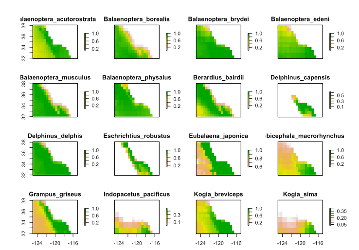
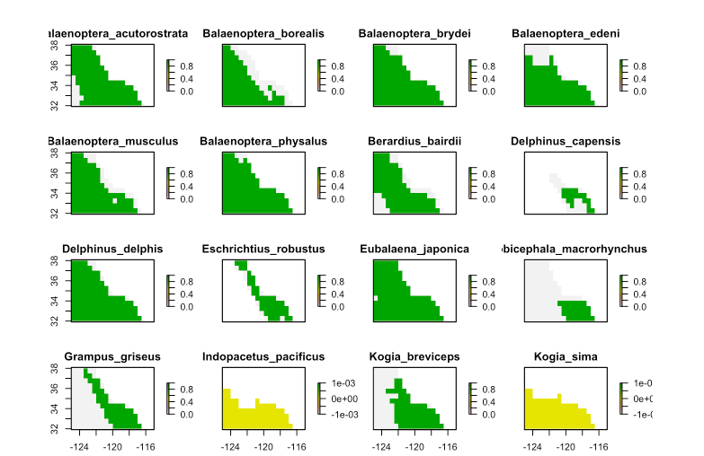
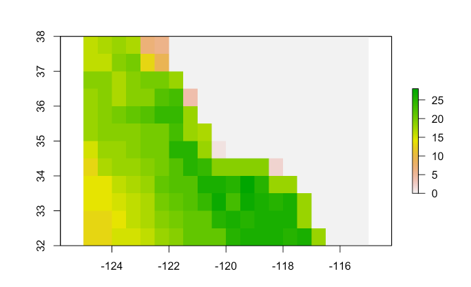
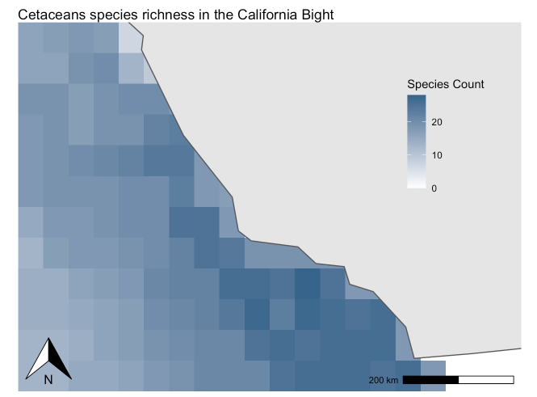

```{r setup, include=FALSE}
knitr::opts_chunk$set(echo = FALSE)
```

There are over 35 different species of cetaceans found in the Southern California Bight, an area that includes coastal Southern California and the Channel Islands. Some of the species found here include humpback whales, blue whales, common dolphin, Pacific white-sided dolphin and many more. The following explores cetaceans species richness in the area using a species distribution maps created by AquaMaps. These species distribution maps were modeled using large sets of occurrence data from GBIF and OBIS combined with estimates of environmental preferences including depth, water temperature, salinity, and primary productivity. 

```{r}
knitr::include_graphics("images/ocs_cetacean_drawings.jpg")
```
Image from Ocean Conservation Society

The data from this analysis uses species distribtuion maps that have already been clipped to the extent of the Southern California Bight. 


**Raw Data:** Kaschner,K., Rius-Barile, J., Kesner-Reyes, K., Garilao, C., Kullander, S., Rees, T., & Froese, R. (2016). AquaMaps: Predicted range maps for aquatic species. www.aquamaps.org

To create a species richness map of all 35 species found in the Southern California Bight, I first had to create a raster stack of all the species distributions:

```{r}

```
Figure 1. Raster stack of all 35 species distribtuion from AquaMaps. 

Next, I reclassified these rasters to be binary precense/absence data using a threshold of probabilities of 0.6 or greater considered "present".

```{r}

```
Figure 2. Raster stack of all 35 species distribution from AquaMaps reclassified as presence or absence data. The distribution shown in yellow indicates that species is not found within the Southern California Bight.  


Then, I combined these all into one raster using the sum function:

```{r}

```
Figure 3. Raster of species richness (species count) in the Southern California Bight with the highest number of species shown in green and the lowest shown in pink and white. 

Lastly, I mapped this to look a little better using 'naturalearths' package to load a shape file of the California coast:

```{r}

```
Figure 4. Species richness of 35 cetaceans species in the Southern California Bight using probability of occurrence from AquaMaps with any probability of 0.6 and higher as presence data.
