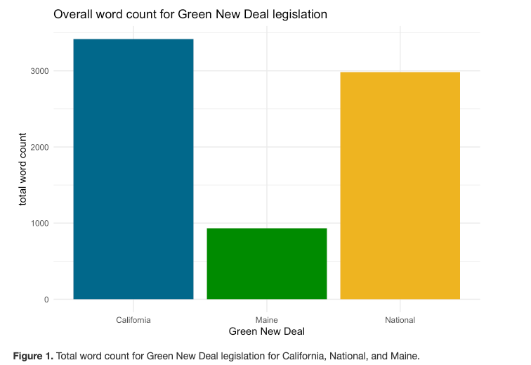
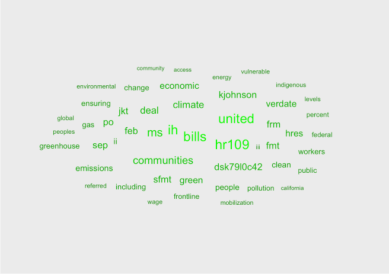
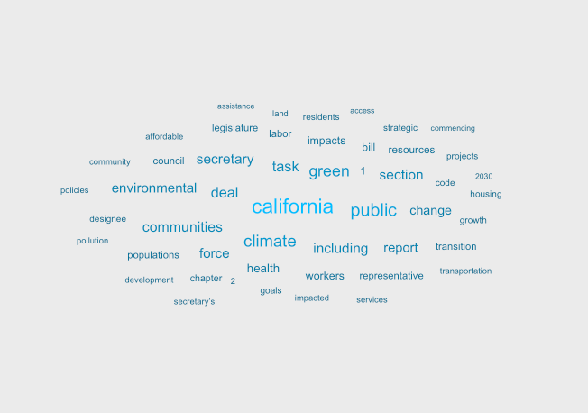
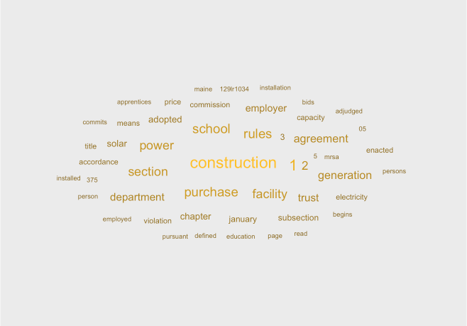
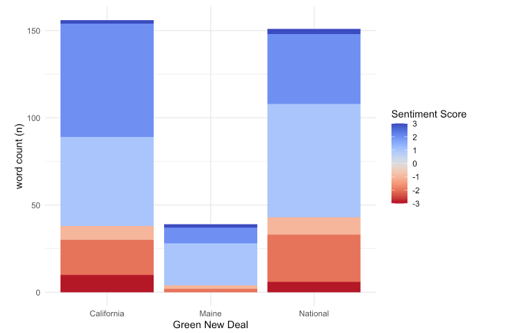
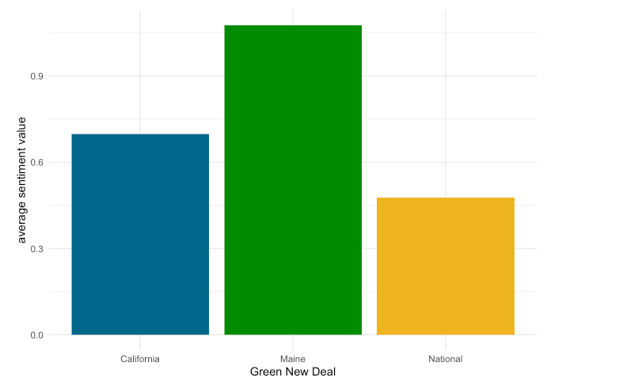

```{r setup, include=FALSE}
knitr::opts_chunk$set(echo = FALSE)
library(tidyverse)
library(tidytext)
library(textdata)
library(pdftools)
library(ggwordcloud)
library(pals)
```

The Green New Deal (GND) is a congressional resolution that focuses on addressing climate change and economic inequality by building a green economy, inclusive of all people, through a fair and just transition. Since the Green New Deal was introduced by Representative Alexandria Ocasio-Cortez of New York and Senator Edward J. Markey of Massachusetts, state and local governments have created their own New Deal policies. The following analysis explores of the most frequently used words in various Green New Deals, comparing the federal resolution with state-level Green New Deals from California and Maine. 

#### Links to original text 

**National GND:** The federal Green New Deal is a 14 page document from February 7, 2019. The original document can be found [here](https://www.congress.gov/116/bills/hres109/BILLS-116hres109ih.pdf)

**California GND:** The California Green New, Assembly Bill 1839, was a 9 page document proposed on January 6, 2020. However, in response to the pandemic the bill was amended in May and lawmakers turned the bill into a California COVID-19 Recovery Deal. This analysis will compare the Green New Deal bill prior to the amendments. The bill can be found [here](https://leginfo.legislature.ca.gov/faces/billTextClient.xhtml?bill_id=201920200AB1839)

**Maine GND:** The Maine Green New Deal is a 6 page document enacted June 17, 2019. The original document can be found [here](http://legislature.maine.gov/legis/bills/bills_129th/billtexts/HP092401.asp)

---

First, lets compare how robust and lengthy each document is by comparing the overall word count.

Some quick takeaways from Figure 1:

The Federal legislation has the largest word count
Maine legislation has far less words in their GND than California and the National GND

```{r}

```
**Figure 1.** Total word count for Green New Deal legislation for California, National, and Maine. 

Next, let’s compare the most used words in each document. To do this, we must remove the common and less interesting words like the, and, of, etc. for each document. 

```{r}

```
**Figure 2.** Wordcloud of the most used words in the National Green New Deal.

```{r}

```
**Figure 3.** Wordcloud of the most used words in the California Green New Deal.

```{r}

```
**Figure 4.** Wordcloud of the most used words in the Maine Green New Deal.

Some interesting takeaways:

* MaineGND uses more words like “construction”, “power”, “school”, “facility”
* California GND uses more words like “public”, “climate”, “green”
* The National GND uses more words like “bills”, “united”, “communities”


Now, let’s look at the overall sentiments found in each document using the AFINN lexicon. The AFINN sentiment lexicon is a lit of terms that has been manually rated between -5 and +5 with negative scored indicating negative sentiments (anger, sadness, etc.) and positive scores indicating positive sentiments (joy, happy, etc.).

Overall, we can see that Maine has far less words associated with negative sentiments (Figure 5). If we looked at the average sentiment score/value for each Green New Deal, we can see that overall Maine has the highest average sentiment score, followed by California (Figure 6).

```{r}

```
**Figure 5.** Overall sentiment of words found in the Green New Deals for California, National, and Maine using the AFINN lexicon that ranks words from -5 to +5.

```{r}

```
**Figure 6.** The mean sentiment score for Green New Deal’s for California, National, and Maine using the AFINN lexicon that ranks words from -5 to +5 depending on the sentiment associated with each word.