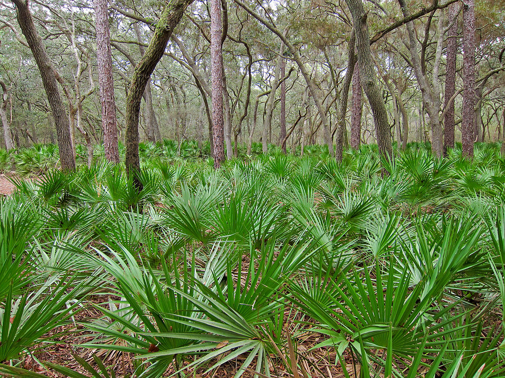

```{r setup, include=FALSE}
knitr::opts_chunk$set(echo = TRUE, warning = FALSE, message = FALSE)
library(tidyverse)
library(janitor)
library(here)
library(GGally)
library(broom)
library(jtools)
library(kableExtra)
```

# Overview {.tabset}




The following explores the feasibility of using height, canopy length, canopy width, and number of green leaves to classify whether a palmetto is *Serenoa repens* or *Sabal etonia* using data from Archbold Biological Station in south-central Florida from 1981-2017. 

**Data source:** Abrahamson, W.G. 2019. Survival, growth and biomass estimates of two dominant palmetto species of south-central Florida from 1981 - 2017, ongoing at 5-year intervals ver 1. Environmental Data Initiative. [https://doi.org/10.6073/pasta/f2f96ec76fbbd4b9db431c79a770c4d5](https://doi.org/10.6073/pasta/f2f96ec76fbbd4b9db431c79a770c4d5)


## Data Exploration

First, I created an overview of differences in height, canopy length, canopy width, and number of new green leaves for both *Serenoa repens* and *Sepal etonia* using various visualizations including a ggpair plot (Figure 1), scatter plot (Figure 2), and density plot (Figure 3). 

```{r}
palmetto <- read_csv("palmetto.csv") %>% 
  mutate(species = case_when(species == 1 ~ "Serenoa repens",
                             species == 2 ~ "Sabal etonia"))

palmetto_pairs <- palmetto %>% 
  select(species, height:green_lvs) %>% 
  ggpairs(aes(color = species))

palmetto_pairs
```


**Figure 1.** An overview of the relationships between species (*Serenoa repens* and *Sabal etonia*), height, canopy length, canopy width, and number of green leaves found at Archbold Biological Station from 1981-2017.

Figure 1 shows that the relationship between many of these variables is similar for both species, especially looking at height vs length, height vs width, and length vs width.

```{r}
ggplot(data = palmetto, aes(x = length, y = width)) +
  geom_point(alpha = 0.5,
             aes(color = species)) +
  scale_color_manual(values=c("turquoise4", "seagreen4"))+
  labs(x = "canopy length (cm)", y = "canopy width (cm)", color = "Species")+
  facet_wrap(~species)
```


**Figure 2.** Canopy length (cm) and canopy width (cm) compared for two palmetto species, *Serenoa repens* and *Sabal etonia*, at Archbold Biological Station from 1981-2017.

Figure 2 shows that as palmetto's canopy length increases so does the canopy width and this relationship is similar for both *Serenoa repens* and *Sabal etonia*.

```{r}
ggplot(data = palmetto, aes(x = green_lvs)) +
  geom_density(aes(fill = species),
               alpha=0.5)+
  scale_fill_manual(values=c("turquoise4", "seagreen4"))+
  labs(x = "number of new green leaves", fill = "Species")

```


**Figure 3.** Density of green leaves for both *Serenoa repens* and *Sabal etonia* at Archbold Biological Station from 1981-2017.

Figure 3 highlights that more *Sabal etonia* tend to have a smaller number of new green leaves than *Serenoa repens*.

## Binary Logistic Regression

The following explores a binary logistic regression using plant height, canopy length, canopy width, and number of new green leaves as predictor variables to calculate the log odds of a plant being *Serenoa repens*. 

To see how the model is set up click the code chunk below:

```{r}
# create df from csv
palmetto_2 <- read_csv("palmetto.csv") %>% 
  mutate(species = case_when(species == 1 ~ "Serenoa_repens",
                             species == 2 ~ "Sabal_etonia"))
# change species to a factor
palmetto_2$species <- as.factor(palmetto_2$species)

# check levels to see how species were factored (Sabel etonia is 0, and Serenoa repens is 1)
## levels(palmetto$species)

palmetto_blr <- glm(species ~ height + length + width + green_lvs,
                            data = palmetto_2,
                            family = "binomial")

palmetto_blr_tidy <- broom::tidy(palmetto_blr)

palmetto_blr_tidy
```


**Table 1:** Binary logistic regression model results for the log odds of a plant being *Serenoa repens* using predictor variables: plant height (cm), canopy length(cm), canopy width (cm), and number of new green leaves. 

```{r}
palmetto_table <- palmetto_blr %>% 
  broom::tidy() %>% 
  select( estimate, std.error, p.value) %>% 
  mutate_if(is.numeric, funs(as.character(signif(.,3)))) %>% 
  slice(-1)

rownames(palmetto_table) <- c("height (cm)", 
                              "length (cm)", 
                              "width (cm)", 
                              "green leaves")
  
palmetto_table_style <- kable(palmetto_table, col.names = c("Estimate", "Standard Error", "p-value")) %>% 
  kable_styling(bootstrap_options = "striped",
                full_width = F,
                position = "left") %>% 
  add_header_above(c("Binary Logistic Regression Model" = 4))

palmetto_table_style
```

**A few takeaways:**

  *  The estimate for height indicates that we expect the log odds of a species being a *Serenoa repens* to increase by `r round(palmetto_blr_tidy[2,2], 2)` for each 1 cm increase in height. 
  * The estimate for length indicates that we expect the log odds of a species being a *Serenoa repens* to increase by `r round(palmetto_blr_tidy[3,2], 2)` for each 1 cm increase in canopy length.
  * The estimate for width indicates that we expect the log odds of a species being a *Serenoa repens* to increase by `r round(palmetto_blr_tidy[4,2], 2)` for each 1 cm increase in canopy width.

## Predictions

Next, I explored how well our binary logistic regression model would predict or classify a plant as the correct species - *Serenoa repens* or *Sabal etonia*. I used a 50% cutoff for the model predictions, so if the model had 50% or greater probability we considered the classification *Serenoa repens*. Table 2 shows how many plants in the original dataset would be correctly or incorrectly classified using our model.

```{r}
# convert the log odds to actual probabilities using broom::augment
palmetto_blr_fitted <- palmetto_blr %>% 
  broom::augment(type.predict = "response")

```

**Table 2.** Probability of a palmetto being *Serenoa repens* using a binary logistic regression model with the predictor variables: plant height (cm), canopy length(cm), canopy width (cm), and number of new green leaves. 

```{r}
palmetto_blr_50 <- palmetto_blr_fitted %>% 
  mutate(prob_50 = case_when(.fitted >= .5 ~ "Serenoa_repens",
                             .fitted < .5 ~ "Sabal_etonia")) %>% 
  mutate(class_correctly = case_when(species == prob_50 ~ "Correct",
                                     species != prob_50 ~ "Incorrect"))

palmetto_count <- palmetto_blr_50 %>% 
  count(species, class_correctly) %>% 
  pivot_wider(names_from = class_correctly, values_from = n) %>% 
  mutate(total = rowSums(across(where(is.numeric)))) %>% 
  mutate(percent_correct = (Correct/total*100)) %>% 
  mutate_if(is.numeric, round, digits = 0) %>% 
  mutate(species = case_when(species == "Serenoa_repens" ~ "Serenoa repens",
                             species == "Sabal_etonia" ~ "Sabal etonia"))


palmetto_count_table <- kable(palmetto_count, col.names = c("Species", "Classified Correctly (n)", "Classified Incorrectly (n)", "Total Species(n)", "Percent Correctly Classfied (%)")) %>%
  kable_styling(bootstrap_options = "striped",
                full_width = F,
                position = "left") %>%
  add_header_above(c("Predicting Serenoa repens" = 5))


palmetto_count_table

```

